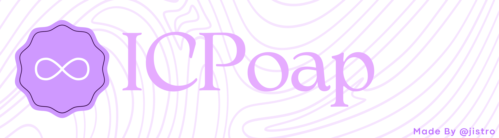

Bienvenido al repositorio de ICPoap (**I**nternet **C**omputer **P**OAP) implementado en Internet Computer Protocol (ICP), usando de backend el lenguaje de programacion *Motoko* 
ICPoap es un proyecto de código abierto que permite a los usuarios de Internet Computer crear y distribuir POAPs (Proof of Attendance Protocol) en la red de Internet Computer.

## ¿Qué es POAP?
Un POAP (Proof of Attendance Protocol) es un token no fungible (NFT) que sirve como prueba de asistencia o participación en un evento específico. Este protocolo utiliza la tecnología blockchain para certificar y registrar de manera inmutable la presencia de una persona en eventos como conferencias, festivales, meetups, competiciones deportivas, entre otros.

La idea principal detrás de POAP es ofrecer una forma digital de reconocimiento y recompensa a los asistentes, permitiéndoles demostrar su participación en ciertos acontecimientos. Cada POAP es único y está asociado a un evento particular, lo que lo convierte en una insignia única y coleccionable.

## ¿Qué es ICPoap?
ICPoap es un protocolo de POAP implementado en Internet Computer que almacena todos los datos en un canister de Internet Computer.

Este protocolo permite tanto el uso común de un POAP como la creación de certificados onchain para la participación o conclusión de cursos, talleres o workshops, sin importar si son presenciales, virtuales o incluso si se llevan a cabo en horarios diferidos.

Con ICPoap, los usuarios pueden recibir y mantener sus insignias digitales de asistencia en la red descentralizada de Internet Computer, lo que garantiza la seguridad, transparencia e inmutabilidad de la información relacionada con la participación en eventos y actividades. Además, el protocolo ofrece la posibilidad de emitir certificados oficiales para validar la finalización exitosa de cursos o talleres.

ICPoap proporciona una solución versátil y confiable para reconocer y recompensar la participación en una amplia variedad de eventos y actividades, contribuyendo así a fortalecer las conexiones entre los participantes y sus experiencias en la plataforma.